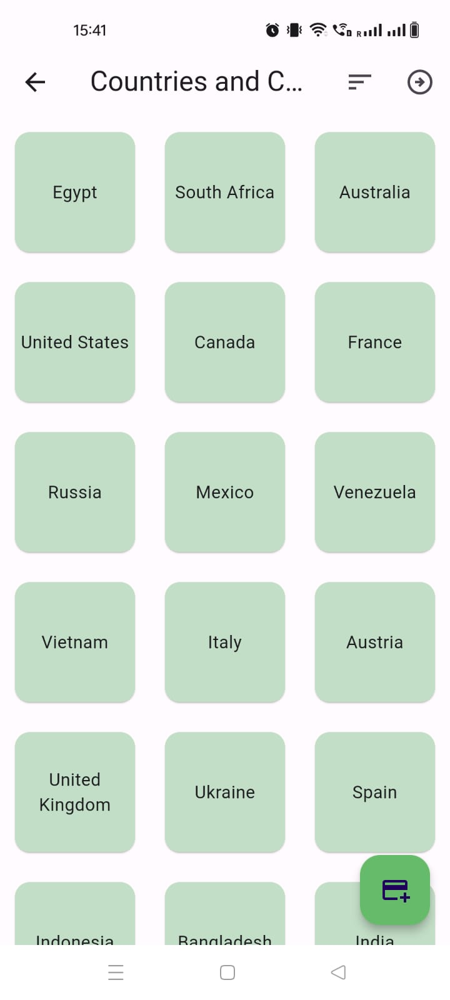

# Flashcards(Quiz) App

## Introduction

Welcome to the Flashcards App! This Flutter project is developed, and aimed at implementing a multi-page application for creating, editing, and managing decks of two-sided flashcards, and running quizzes using these flashcards.

The app allows users to perform various operations such as creating, editing, and deleting decks, creating, editing, sorting, and deleting flashcards associated with a specific deck, loading a "starter set" of decks and flashcards from a provided JSON file, persisting all decks and flashcards across application restarts, and running quizzes with flashcards from a specific deck.

## Features

### 1. Creating, Editing, and Deleting Decks

- Users can create new decks, edit existing decks, and delete decks.
- Each deck contains a collection of flashcards.

### 2. Creating, Editing, Sorting, and Deleting Flashcards

- Users can create new flashcards within a deck, edit existing flashcards, sort flashcards alphabetically or by creation order, and delete flashcards.

### 3. Loading Starter Set of Decks and Flashcards

- The app provides an option to load a "starter set" of decks and flashcards from a JSON file.

### 4. Persistence

- All decks and flashcards are persisted locally, ensuring data integrity across application restarts.

### 5. Running Quizzes

- Users can run quizzes using flashcards from a specific deck.
- The app randomly shuffles flashcards for each quiz session and allows users to navigate through cards forward and backward.
- Users can view questions and answers during the quiz session for knowledge review.

### 6. Responsiveness

- The app is responsive to changes in screen size, ensuring optimal user experience across devices.
- Deck and flashcard list pages adjust layout dynamically based on screen real estate.

## Output

<table>
  <tr>
    <td>Decks Page</td>
     <td>Decks Page Fetching</td>
     <td>Quiz Cards</td>
     <td>Edit Flashcard</td>
  </tr>
  <tr>
    <td></td>
    <td></td>
    <td></td>
    <td></td>
  </tr>
 </table>

 <table>
  <tr>
    <td>Adding New Deck</td>
     <td>Quiz Page Question</td>
     <td>Quiz Page Answer</td>
  </tr>
  <tr>
    <td></td>
    <td></td>
    <td></td>
  </tr>
 </table>

## Implementation

### External Packages

- Utilizes `provider` for state management.
- Utilizes `collection`, `sqflite`, `path_provider`, and `path` for database operations and file handling.

### Database

- Data is persisted to a local SQLite database using `sqflite`.
- Separate tables are maintained for decks and cards, linked by a foreign key relationship.

### Navigation

- Navigation between different pages of the app is managed using `MaterialApp`'s `Navigator`.
- Five distinct pages are implemented: Deck list, Deck editor, Card list, Card editor, and Quiz.

### JSON Initialization

- Initializes database with decks and cards from a JSON file located in "assets/flashcards.json".

### Code Structure and Organization

- UI code is modularized for readability and maintainability.
- Major widget classes reside in separate files in the "lib/views" directory.
- Model classes reside in separate files in the "lib/models" directory.
- Helper classes reside in separate files in the "lib/utils" directory.

### Asynchronous Operations

- Asynchronous operations, including database operations, are managed to prevent UI blocking.
- Utilizes `FutureProvider`, `FutureBuilder`, or `StreamBuilder` for managing asynchronous operations.

## Testing

The app is tested on various screen sizes ranging from 320x568 logical pixels (iPhone 5) to 1920x1080 logical pixels (1080p). It ensures correct functionality and responsiveness across different devices.
